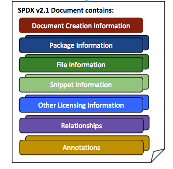

# 1 Rationale（理論的根拠）

## 1.1 Charter（ 趣意） 

ライセンスや他のポリシー コンプライアンスを容易にできるように、ソフトウェアや関連物に対するライセンスやコンポーネント情報（メタデータ）を、企業や組織が共有するためのデータ交換規格を作成すること

## 1.2 Definition （定義） 

Software Package Data Exchange（ソフトウェア パッケージ データ交換）（SPDX &reg;）仕様は、ソフトウェア パッケージに関連するコンポーネント、ライセンスや著作権 を伝えるためのフォーマットである。SPDXファイルは、特定のソフトウェア パッケージやパッケージ セットに関連付けられており、SPDXフォーマットの情報を保持している。

## 1.3 Why is a common format for data exchange needed?（データ交換用の共通フォーマットはなぜ必要なのか？）

企業や組織（合わせて「組織」）は、オープン ソースや他のソフトウェア パッケージを広く利用や再利用している。関連するライセンス コンプライアンスを達成するには、各「組織」で独立して実施される解析活動や精査（due diligence）が必要となる。それらの活動には、人手または自動で実施されるソフトウェア スキャンと関連ライセンスの特定、および人手によるそれらの結果確認が含まれる。世界中のソフトウェア開発チームが同一のオープン ソース パッケージを利用するが、解析の共同作業や解析結果の共有を促進するインフラはほとんどない。その結果、多くのグループが、重複する努力と余分な情報を生み出す同じ作業を行っていることになる。SPDX作業グループは、データ交換フォーマットの作成を試みている。その結果、時間の節約とデータの正確さ向上を目指して、ソフトウェア パッケージと関連物の情報が共通フォーマットで収集、共有されることが期待できる。

## 1.4 What does this specification cover?（この仕様はどの項目をカバーしているか？）

**1.4.1** SPDX Document Creation Information（SPDX文書生成情報）：解析結果の表記に使われるSPDXファイルとライセンスリストの特定のバージョンおよび、誰が、いつ、どのようにSPDXファイルを作成したかに関するメタデータ

**1.4.2** Package Information（パッケージ情報）：パッケージ全体が共通に有する事実

**1.4.3** File Information（ファイル情報）：パッケージ内の各ファイルに特有の事実

**1.4.4** Snippet Information（コード断片情報）：ファイルの一部分にだけ特有の事実

**1.4.5** Other Licensing Information Detected（検出された他ライセンス情報）：SPDXライセンス リストにないライセンスに対する検出方法や参照情報

**1.4.6** Relationships Between SPDX Elements（SPDX要素間関連情報）：文書、パッケージおよびファイルの相互関連に対する情報

**1.4.7** Annotations（注釈）：SPDXファイルが、いつ、誰によってレビューされたかの情報

## 1.5 What is not covered in the specification?（この仕様はどの項目をカバーしないか？）

**1.5.1** 解析対象パッケージの検査（手動、自動を問わず）からは得られない情報

**1.5.2** SPDXファイルに保管されたデータの受領者側の利用方法

**1.5.3** パッケージに関連、非関連の特許についての一切の特定

**1.5.4** ライセンスの法的解釈や、実施済みや実施すべきコンプライアンス活動

**1.5.5** 例は“...”を含むが、これはSPDX文書に特有の詳細テキストを示す

## 1.6 Format Requirements （フォーマットに対する要求） 

**1.6.1** 人間によって可読でなければならない

**1.6.2** ソフトウェア ツールが読み書きできる構文で記述されなければならない

**1.6.3** 作成方法（人手やツール）に依存せず、構文チェックに適していなければならない

**1.6.4** SPDXファイルのキャラクター セットは、UTF-8エンコードをサポートしなければならない

**1.6.5** 仕様が使う構文は自動検証が可能でなければならない

**1.6.6** 注釈付きタグ値フラット テキスト ファイル（annotated tag value flat text file）と同様に、リソース記述フレームワーク（RDF）で情報を記述できなければならない

**1.6.7** 注釈付きタグ値フォーマットとRDFフォーマットの相互運用性は保持されなければならない

**1.6.8** タグとRDFの用例は、大文字小文字を区別する

**1.6.9** ファイル システム上でファイルを開かなくても認識しやすくするべきである推奨されるネーミング慣例は、*.spdx（タグ値フォーマット）と*­spdx.rdf（RDFフォーマット）である

**1.6.10** この仕様での慣例として、RDFの例　`rdf:about="..."`　は、適切な統一資源指示子（URI）が提示されるべきことを示す

## 1.7 Conformance（適合） 

**1.7.1** SPDX Trademark License （SPDX商標ライセンス）の要求をすべて満足すれば、ファイルをSPDX文書と呼ぶことができる (SPDX商標ページを参照)

**1.7.2** このSPDX &reg; 仕様2.1の逐語的な複製または頒布に使う公式な著作権表記は以下である：

"Official SPDX &reg; Specification 2.1.1 Copyright &copy; 2010-2018 Linux Foundation and its Contributors. Licensed under the Creative Commons Attribution License 3.0 Unported. All other rights are expressly reserved."

**1.7.3** このSPDX仕様の非逐語的な複製または頒布に使う公式な著作権表記は以下である。制限なしの部分的な利用やこのSPDX仕様を他の作品と結合する場合を含む：

"This is not an official SPDX Specification. Portions herein have been reproduced from SPDX &reg; Specification 2.1.1 found at spdx.org. These portions are Copyright &copy; 2010-2018 Linux Foundation and its Contributors, and are licensed under the Creative Commons Attribution License 3.0 Unported by the Linux Foundation and its Contributors. All other rights are expressly reserved by Linux Foundation and its Contributors."

## 1.8 Differences from SPDX Specification 2.0（SPDX仕様2.0からの差分） 

**1.8.1** ファイルの一部分がファイル全体と異なる属性を持てるように、コード断片（Snippets）が追加された。コード断片の仕様は、完全に任意であり、コード断片を識別する必要はない。コード断片を記述するフィールドの詳細については、[セクション5 コード断片情報](./5-snippet-information.md) を参照。

**1.8.2** 外部パッケージが、SPDX文書中で参照可能となった。これらの外部パッケージを示すSPDXファイル情報が無い場合には、パッケージの`filesAnnalyzed `属性はFalseにするべきである。詳細は、[section 3.8](3-package-information.md#3.8)  Files Analyzed（解析したファイル）を参照。

**1.8.3** 追加情報、メタデータ、要素列挙（Enumeration）やパッケージに関連すると考えられるダウンロード可能なコンテンツについての外部ソースへの参照を許す「外部参照」をパッケージに関連付けることができる。参照：[3.21 外部参照](3-package-information.md#3.21), [3.22 外部参照コメント](3-package-information.md#3.22) 、詳細は [Appendix VI: 外部リポジトリ識別子](./appendix-VI-external-repository-identifiers.md) 

**1.8.4** ファイル レベルに置かれた “Artifact of Project”（「派生元プロジェクト」）フィールドは、より記述的な外部パッケージへの関連で置き換えられるので、廃止予定となっている。

**1.8.5** 新しいAppendix「ソース ファイルでのSPDX簡易識別子の利用」が文書に追加された。これは開発コミュニティから生まれたもので、SPDXライセンス リスト中のライセンスを参照するベスト プラクティスである。詳細は、[Appendix V: ソース ファイルでのSPDX簡易識別子の利用](./appendix-V-using-SPDX-short-identifiers-in-source-files.md) を参照。

**1.8.6** メーリングリストや[spdx-spec GitHub repository](https://github.com/spdx/spdx-spec)にて報告された雑多の不具合修正。